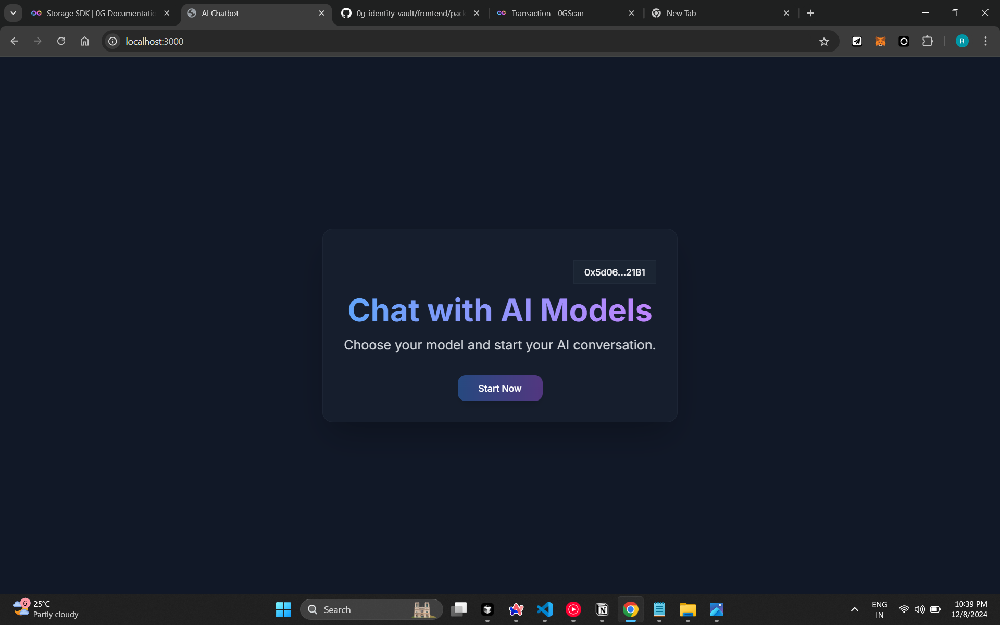
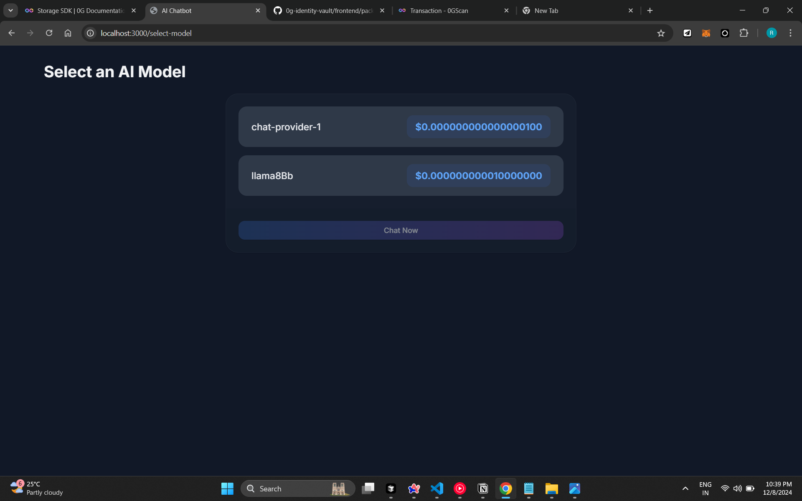
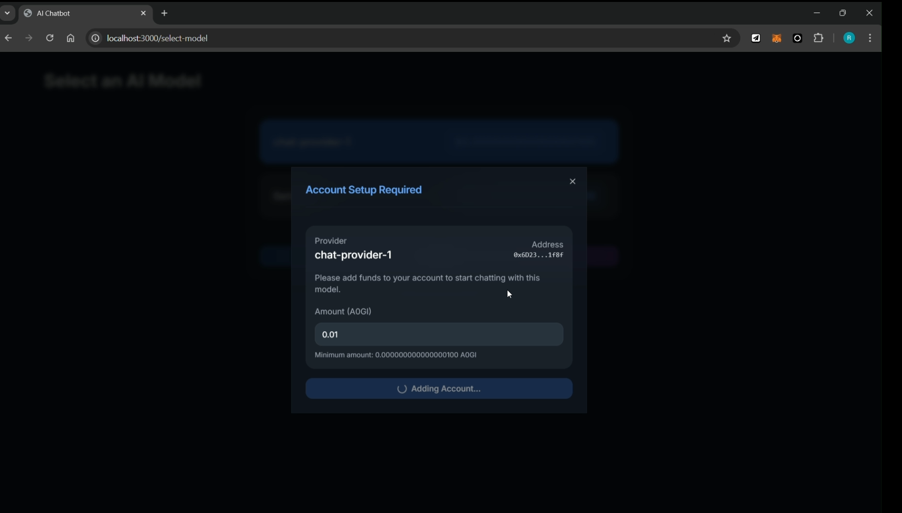
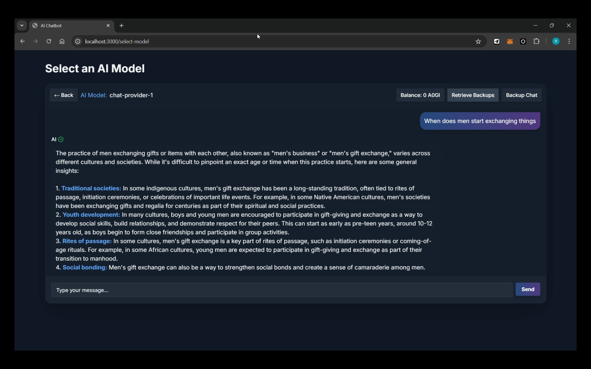
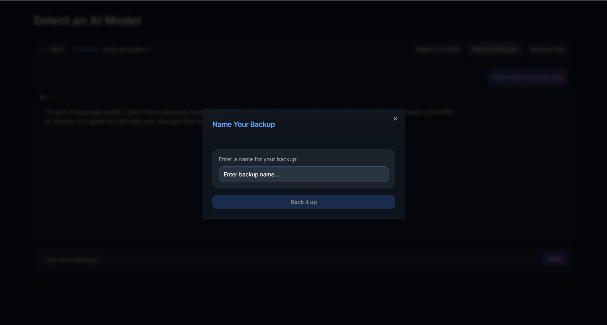
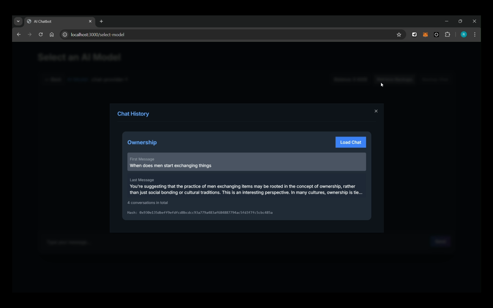

# **DeCentraChat**

Welcome to **DeCentraChat** — your one-stop decentralized platform for AI-powered model inferences. With 0gLab’s serving layer, experience seamless querying of a wide range of AI models in one place. Leveraging decentralized AI model inferences, we ensure reduced latency through multiple GPU service providers.

---

## **Tech Stack**

- **0g Serving User Broker**: Enables decentralized AI model inferences by interacting with multiple GPU service providers.
- **0g Storage SDK**: Facilitates secure and decentralized storage of chat conversations and data.
- **Solidity**: Smart contract language used for storing and retrieving root hashes on the blockchain.
- **Wagmi and Viem**: Provides React hooks and Ethereum utilities for seamless blockchain integration.
- **Next.js**: Framework used for building the frontend and server-side rendering for optimal performance.

---

To view the project in action,visit https://decentrachat.vercel.app/ <br> (This needs users to execute the below program in their local machine for each request they send)
**Note:** Make sure to follow the instructions specified at https://github.com/Raaghav-m/Decentrachat-helper

To get multiple requests,execute the below steps to get the code in your local system

## **Setting Up the Project**


1. **Clone the Repository**:
   ```bash
   git clone https://github.com/Raaghav-m/DeCentraChat
   cd DeCentraChat
   ```
2. Install Dependencies:
   ```bash
   npm install
   ```
3. Start the Local Server:
   ```bash
   npm run dev
   ```
   **Access the Application**: Open your browser and navigate to http://localhost:3000. Ensure you have Metamask installed for blockchain interactions.

---

**Key Features**

- Contextual AI: Transform stateless AI models into contextual AI by leveraging advanced prompt engineering techniques.
- Conversation Backup: Use 0g storage to securely store your chat history, allowing you to continue conversations where you left off.
- Smart Contract Integration: Efficiently store and retrieve root hashes of conversations for enhanced transparency and quick access.
- Model Selection: Choose from a range of AI models tailored to your use case, all at an affordable cost.

**Security and Privacy**

- Data is securely stored on decentralized nodes using 0g storage.
- Root hashes are stored on the blockchain, ensuring tamper-proof and transparent backups.
- User credentials and sensitive data are never stored or shared.

**Usage Examples**

- Connect Wallet:
  Open the application and click "Connect Wallet."
  Authenticate using Metamask to link your Ethereum address.

  

- Choose an AI Model:
  Browse through a curated list of AI models, each designed for specific use cases (e.g., NLP, image generation, etc.).

  

- Create account
  Create an account associated with the provider and deposit funds.

  

- Send a Prompt:
  Enter your query or command in the chatbox and let the selected AI model respond.

  

- Backup Conversations:
  Store your chat history securely on 0g storage by clicking "Backup." Root hashes are generated and stored on the blockchain for future retrieval.

  

- Retrieve Conversations:
  Retrieve your chat history from the blockchain by clicking "Retrieve."

  
